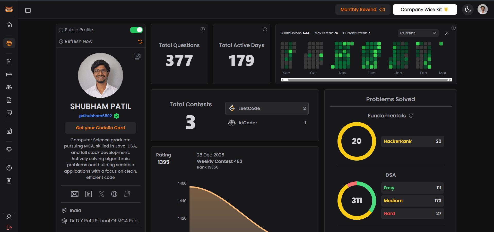
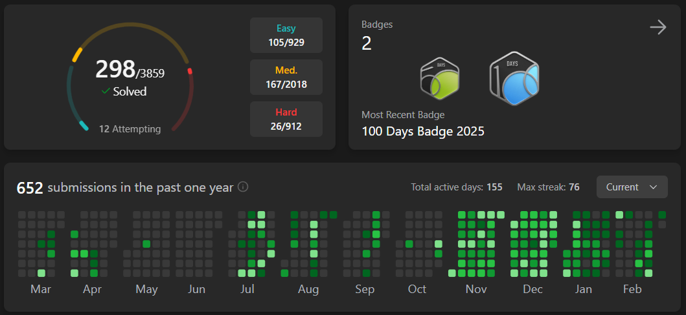
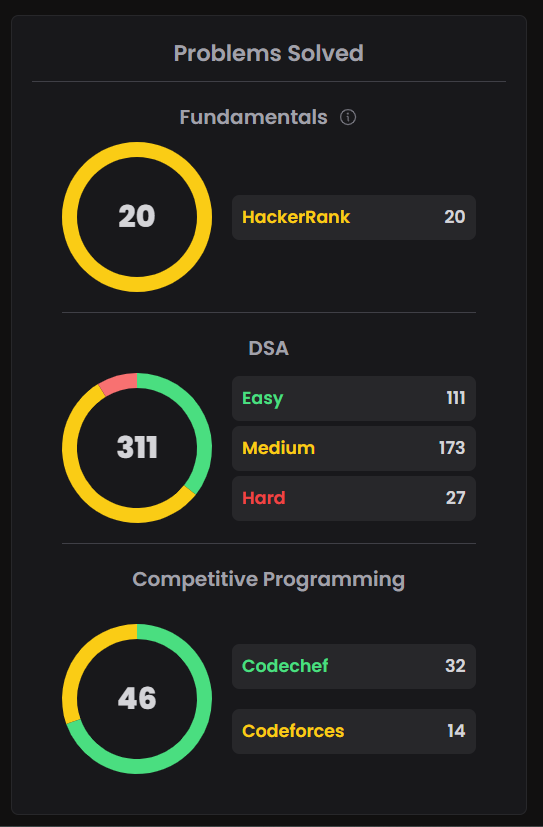

# 🚀 Shubham Patil — Data Structures & Algorithms Journey

<p align="center">
  <b>Consistency • Problem Solving • Interview Preparation</b>
</p>

---

## 👨‍💻 About This Repository

This repository documents my daily practice of **Data Structures and Algorithms (DSA)** as part of my preparation for Software Engineering roles.

I actively solve algorithmic problems across multiple coding platforms to strengthen:

* Problem-solving skills
* Algorithmic thinking
* Optimization techniques
* Interview readiness

This repository serves as a **public learning log** showcasing continuous improvement and disciplined practice.

---

## 📊 Live Problem Solving Profile

🔗 **Codolio Profile:**
👉 https://codolio.com/profile/Shubham6502

This profile aggregates my activity from coding platforms and reflects my real-time problem-solving progress.

---

## 📈 Problem Solving Statistics

| Platform         | Focus Area               |
| ---------------- | ------------------------ |
| LeetCode         | DSA & Interview Problems |
| GeeksforGeeks    | Concept Reinforcement    |
| Coding Platforms | Daily Practice           |

> Daily consistency and gradual improvement are the primary goals.

---

## 🧠 Topics Covered

* Arrays & Hashing
* Strings
* Recursion & Backtracking
* Linked Lists
* Stack & Queue
* Trees & Binary Trees
* Graph Algorithms
* Dynamic Programming
* Greedy Algorithms
* Sliding Window
* Two Pointers
* Binary Search

---

## 🗂 Repository Structure

```
dsa-daily-practice/
│
├── Arrays/
├── Strings/
├── LinkedList/
├── Stack/
├── Queue/
├── Trees/
├── Graph/
├── DynamicProgramming/
├── Patterns/
│
├── progress-tracker.md
└── resources.md
```

Each solution includes:

✅ Problem explanation
✅ Approach used
✅ Time & Space Complexity
✅ Optimized implementation

---

## 🔥 Daily Progress Tracker

| Date        | Problem          | Topic   | Difficulty | Platform |
| ----------- | ---------------- | ------- | ---------- | -------- |
| 02 Mar 2026 | Two Sum          | Arrays  | Easy       | LeetCode |
| 02 Mar 2026 | Valid Palindrome | Strings | Easy       | LeetCode |

Full history available in **progress-tracker.md**

---

## 📸 Live Coding Activity (Screenshots)

### 🧩 Codolio Activity Overview




---

### 📊 Problem Solving Heatmap(Leetcode)




---

### 🏆 Platform Statistics




---

## ⚙️ Languages Used

* Java (Primary Language)
* JavaScript (Secondary)

---

## 🎯 Learning Approach

I follow a structured problem-solving strategy:

1. Understand brute-force solution
2. Optimize using patterns
3. Analyze complexity
4. Refactor for clean code
5. Document learning

---

## 📚 Patterns Practiced

* Sliding Window
* Two Pointer Technique
* Prefix Sum
* Fast & Slow Pointer
* DFS / BFS
* Backtracking
* Dynamic Programming State Design

---

## 🏁 Current Goals

* Solve problems consistently every day
* Strengthen Dynamic Programming and Graph concepts
* Improve optimization thinking
* Prepare for technical interviews

---

## 📅 Weekly Learning Reflection

| Week   | Problems Solved | Key Learning         |
| ------ | --------------- | -------------------- |
| Week 1 | In Progress     | Building consistency |

---

## 🌱 Continuous Improvement

> “Small daily improvements lead to long-term mastery.”

---

## 👤 Author

**Shubham Patil**
MCA Student | Software Engineering Aspirant
Focused on mastering Data Structures & Algorithms.

---

⭐ If you find this repository useful, feel free to star it.
